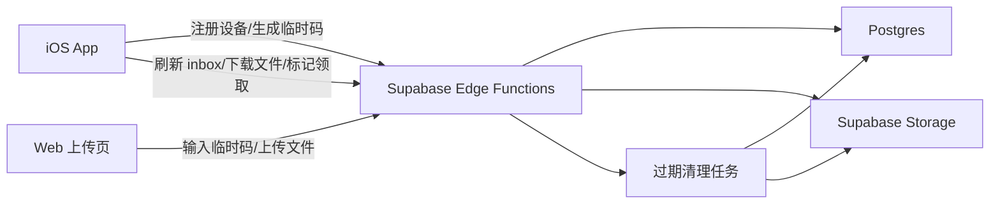

# 简声网站传书设计

日期：2026-07-22

状态：已确认

目标阶段：V2 最小可用网站传书

## 1. 目标

为“简声”增加一个不需要登录注册的网站传书能力。协助者可以在网页输入 App 显示的临时传书码，上传 TXT、EPUB 或无 DRM MOBI 文件；用户随后在 App 内接收并导入到本地书架。

第一版只解决“从 Web 端把书临时传到某个 App 安装实例”这一条主链路，不做云书库、账号体系、长期文件管理、LLM 精修或跨设备同步。

## 2. 核心原则

- 不读取 IMEI、UDID、IDFA，也不生成设备指纹。
- App 首次使用传书功能时生成随机传书身份，身份只代表当前 App 安装实例。
- 传书身份和设备密钥存入 Keychain，用户可以在设置中重置。
- Web 端只通过短期临时传书码绑定到 App，不知道用户身份。
- 上传文件默认 72 小时过期，导入成功后立即标记领取并删除云端文件。
- 传书功能与 StoreKit、LLM 精修、阅读记录完全分离。
- 导入页保持 VoiceOver 基础可用，但传书上传流程不作为最高优先级无障碍流程。

## 3. 范围

### 3.1 本期包含

- App 生成和保存传书身份。
- App 生成临时传书码。
- Web 输入传书码并上传 TXT、EPUB、MOBI。
- App 拉取待接收文件列表。
- App 下载文件并复用现有导入流程。
- 导入成功后云端文件标记为已领取并删除。
- 用户可以删除待接收文件。
- 后端自动清理 72 小时过期文件。
- 单文件大小限制为 250 MB。

### 3.2 本期不包含

- 登录、注册、手机号或邮箱绑定。
- Web 端长期文件管理。
- 多设备同步。
- LLM 目录精修、去广告或格式修复。
- 付费、积分或订阅。
- DRM 解密。
- 在线阅读或在线播放。

## 4. 架构

使用 Supabase 作为第一版后端：

- Supabase Postgres 保存传书身份、临时码和上传记录。
- Supabase Storage 保存待领取文件。
- Supabase Edge Functions 提供所有外部接口。
- Supabase Scheduled Functions 或 cron 负责过期清理。
- Web 上传页使用 Supabase Edge Functions，不直接持有 service role key。
- iOS App 使用 HTTPS API 访问 Edge Functions，不直接读写数据库表。



## 5. 传书身份与临时码

### 5.1 App 传书身份

App 首次进入“网站传书”时创建：

- `transferDeviceId`：UUID v4，用于标识当前 App 安装实例。
- `deviceSecret`：随机 256-bit 字符串，用于调用 App 侧接口认证。

两者保存在 Keychain。用户卸载 App 或主动重置传书身份后，旧身份不再作为当前设备使用。旧身份下未领取文件会按 72 小时过期策略清理。

### 5.2 临时传书码

临时传书码用于 Web 端上传时绑定目标 App：

- 格式：8 位数字，便于朗读和人工输入。
- 有效期：10 分钟。
- 每次生成新码时，旧的未过期码失效。
- 后端只保存传书码 hash，不保存明文。
- 同一传书码最多允许 5 次错误尝试。
- 上传成功后传书码仍可在有效期内继续上传多本书；用户重新生成码会立即替换旧码。

## 6. 数据模型

### 6.1 `transfer_devices`

保存 App 安装实例。

- `id uuid primary key`
- `secret_hash text not null`
- `created_at timestamptz not null`
- `last_seen_at timestamptz not null`
- `reset_at timestamptz`
- `disabled_at timestamptz`

### 6.2 `transfer_pairing_codes`

保存临时传书码。

- `id uuid primary key`
- `device_id uuid not null references transfer_devices(id)`
- `code_hash text not null`
- `expires_at timestamptz not null`
- `attempt_count integer not null default 0`
- `revoked_at timestamptz`
- `created_at timestamptz not null`

约束：

- 同一 `device_id` 同时只保留一个未过期、未撤销的有效码。
- `code_hash` 建唯一索引，避免有效期内碰撞。

### 6.3 `transfer_uploads`

保存待领取文件。

- `id uuid primary key`
- `device_id uuid not null references transfer_devices(id)`
- `original_filename text not null`
- `storage_path text not null`
- `format text not null`
- `byte_size bigint not null`
- `status text not null`
- `created_at timestamptz not null`
- `expires_at timestamptz not null`
- `claimed_at timestamptz`
- `deleted_at timestamptz`
- `failure_reason text`

`status` 取值：

- `pending`：待 App 接收。
- `claimed`：App 已成功导入。
- `deleted`：用户主动删除。
- `expired`：超过 72 小时自动清理。
- `failed`：上传或后端处理失败。

### 6.4 `transfer_upload_sessions`

保存 Web 端通过临时传书码换取的短期上传会话。

- `id uuid primary key`
- `device_id uuid not null references transfer_devices(id)`
- `pairing_code_id uuid not null references transfer_pairing_codes(id)`
- `expires_at timestamptz not null`
- `created_at timestamptz not null`
- `revoked_at timestamptz`

约束：

- 上传会话有效期不超过对应传书码有效期。
- 上传会话只允许创建指向同一 `device_id` 的上传记录。
- 临时码撤销或过期后，相关上传会话同时失效。

## 7. API 设计

所有 API 由 Edge Functions 暴露。数据库表不直接开放给 Web 或 App 客户端。

### 7.1 App 注册设备

`POST /transfer/device/register`

请求：

```json
{
  "deviceId": "UUID",
  "deviceSecret": "random-secret"
}
```

响应：

```json
{
  "deviceId": "UUID",
  "registered": true
}
```

用途：App 首次使用传书功能时注册当前安装实例。重复调用必须幂等。

### 7.2 App 生成临时传书码

`POST /transfer/pairing-code`

认证：`deviceId + deviceSecret`

响应：

```json
{
  "code": "12345678",
  "expiresAt": "2026-07-22T10:10:00Z"
}
```

用途：App 展示给协助者输入到网页。

### 7.3 Web 校验传书码

`POST /transfer/web/resolve-code`

请求：

```json
{
  "code": "12345678"
}
```

响应：

```json
{
  "uploadSessionId": "UUID",
  "expiresAt": "2026-07-22T10:10:00Z"
}
```

用途：Web 上传页确认传书码可用，并创建短期上传会话。响应不暴露 `deviceId`。

### 7.4 Web 上传文件

`POST /transfer/web/upload`

认证：`uploadSessionId`

请求：`multipart/form-data`

响应：

```json
{
  "uploadId": "UUID",
  "filename": "example.txt",
  "byteSize": 43620762,
  "format": "txt",
  "expiresAt": "2026-07-25T10:00:00Z"
}
```

后端校验：

- 文件大小不超过 250 MB。
- 扩展名必须为 `.txt`、`.epub` 或 `.mobi`。
- MIME 和文件头尽可能匹配格式。
- 文件名去除路径、控制字符和不可显示字符。
- Storage path 使用后端生成的 UUID，不使用原始文件名。

### 7.5 App 拉取待接收文件

`GET /transfer/inbox`

认证：`deviceId + deviceSecret`

响应：

```json
{
  "items": [
    {
      "id": "UUID",
      "filename": "example.txt",
      "byteSize": 43620762,
      "format": "txt",
      "createdAt": "2026-07-22T10:00:00Z",
      "expiresAt": "2026-07-25T10:00:00Z"
    }
  ]
}
```

只返回当前设备 `pending` 且未过期的文件。

### 7.6 App 获取下载链接

`POST /transfer/uploads/{uploadId}/download-url`

认证：`deviceId + deviceSecret`

响应：

```json
{
  "downloadUrl": "signed-url",
  "expiresInSeconds": 300
}
```

下载链接 5 分钟有效。App 下载到临时目录后复用现有导入流程。

### 7.7 App 标记已领取

`POST /transfer/uploads/{uploadId}/claim`

认证：`deviceId + deviceSecret`

请求：

```json
{
  "importedBookId": "local-book-id"
}
```

响应：

```json
{
  "status": "claimed"
}
```

只有本地导入成功后才调用。后端随后删除 Storage 文件。

### 7.8 App 删除待接收文件

`DELETE /transfer/uploads/{uploadId}`

认证：`deviceId + deviceSecret`

响应：

```json
{
  "status": "deleted"
}
```

用于用户主动清理不需要的上传文件。

## 8. iOS 集成

### 8.1 新增模块

- `TransferIdentityStore`：Keychain 读写 `transferDeviceId` 和 `deviceSecret`。
- `WebTransferClient`：封装 Edge Functions API。
- `WebTransferViewModel`：管理临时码、倒计时、inbox、下载、导入和错误状态。
- `WebTransferView`：放在“导入”页中的网站传书入口。

### 8.2 导入流程

1. 用户或协助者在 App 的“导入”页打开“网站传书”。
2. App 注册传书身份并生成临时码。
3. 协助者在 Web 端输入临时码并上传文件。
4. App 手动刷新待接收列表。
5. 用户点选文件后，App 获取短期下载链接。
6. App 下载文件到临时目录。
7. App 调用现有 `ImportCoordinator` 导入文件。
8. 导入成功后调用 `claim`。
9. 导入失败时保留云端 `pending` 状态，用户可重试或删除。

### 8.3 交互要求

- “网站传书”入口放在导入页，不放到书架主流程。
- 临时码使用大字号显示，并支持复制。
- 临时码过期后按钮文案变为“重新生成传书码”。
- 待接收列表显示文件名、格式、大小和过期时间。
- 下载或导入失败时显示可理解错误，例如“文件已过期”“网络不可用”“格式不支持”“设备空间不足”。
- VoiceOver 至少能读出传书码、过期时间、刷新按钮、文件条目、导入按钮和删除按钮。

## 9. Web 上传页

Web 上传页第一版只包含一个简单流程：

1. 输入临时传书码。
2. 选择 TXT、EPUB 或 MOBI 文件。
3. 显示文件大小和格式。
4. 点击上传。
5. 上传成功后提示回到 App 刷新。

错误状态：

- 传书码不存在或已过期。
- 传书码错误次数过多。
- 文件超过 250 MB。
- 文件格式不支持。
- 上传中断。
- 后端暂时不可用。

网页不提供登录、历史列表、在线预览或批量管理。

## 10. 错误处理

- 注册设备失败：App 提示稍后重试，不影响本地导入。
- 生成临时码失败：保留旧页面状态，显示网络错误。
- Web 上传失败：不创建 `pending` 记录，或创建后标记 `failed` 并删除 Storage 残留。
- App 下载失败：文件保持 `pending`，允许重试。
- App 导入失败：文件保持 `pending`，不调用 `claim`。
- `claim` 失败：App 本地导入不回滚；下次刷新时可以再次尝试标记领取。
- 清理任务失败：下一次定时任务继续处理，过期文件不会展示给 App。

## 11. 安全与隐私

- Edge Functions 使用 service role key；Web 和 App 客户端只持有公开配置和短期凭据。
- 数据库表启用 RLS，即使第一版主要通过 Edge Functions 访问，也保留防御层。
- Storage bucket 不公开。
- 文件下载必须使用短期 signed URL。
- 后端不记录小说正文内容，只保存文件元数据和 Storage path。
- 文件名只用于展示，不能参与 Storage path 拼接。
- 传书码错误尝试要增加计数并限制暴力猜测。
- 日志中不能打印临时码明文、deviceSecret 或 signed URL。

## 12. 测试策略

### 12.1 iOS 单元测试

- 首次使用传书功能时生成并持久化随机身份。
- 重启 App 后读取同一传书身份。
- 重置传书身份后生成新身份。
- 生成临时码成功后显示码和过期时间。
- inbox 能正确解析 TXT、EPUB、MOBI 条目。
- 下载成功后调用现有导入流程。
- 导入成功才调用 `claim`。
- 导入失败不调用 `claim`。
- `claim` 失败不会删除本地已导入书籍。
- 文件过大、过期、网络失败显示对应错误。

### 12.2 后端测试

- 注册设备接口幂等。
- 临时码 10 分钟后不可使用。
- 生成新码会撤销旧码。
- 错误码尝试超过限制后拒绝。
- 不支持格式被拒绝。
- 超过 250 MB 的文件被拒绝。
- 成功上传后创建 `pending` 记录。
- `claim` 只能由目标设备调用。
- 删除只能由目标设备调用。
- 过期清理会标记 `expired` 并删除 Storage 文件。

### 12.3 手工验收

- 在 App 生成传书码，Web 上传 41.6 MB TXT，App 刷新后可导入。
- 上传 EPUB 后 App 可导入并打开阅读。
- 上传无 DRM MOBI 后 App 可导入并打开阅读。
- 关闭网络时 App 给出清晰失败提示。
- 临时码过期后 Web 无法继续上传。
- App 删除待接收文件后 Web 上传记录不再出现在 inbox。
- VoiceOver 能完成 App 侧查看传书码、刷新、选择文件、导入、删除。

## 13. 后续扩展

本设计为后续能力预留但不在本期实现：

- Web 端多文件队列。
- 上传后自动通知 App。
- LLM 精修接入同一上传链路。
- 协助者模式下的短期网页管理页。
- 传书完成后的短信或邮件提醒。
- 私有化部署或自有对象存储替换 Supabase Storage。

## 14. 关键决策

- 采用 Supabase 作为第一版云端后端。
- 第一版使用 8 位数字临时码。
- 临时码有效期 10 分钟。
- 单文件上限 250 MB。
- 文件保留 72 小时。
- 上传成功后由 App 手动刷新接收，不做推送。
- 不使用任何真实硬件设备号。
- 不做账号体系和云端书库。
